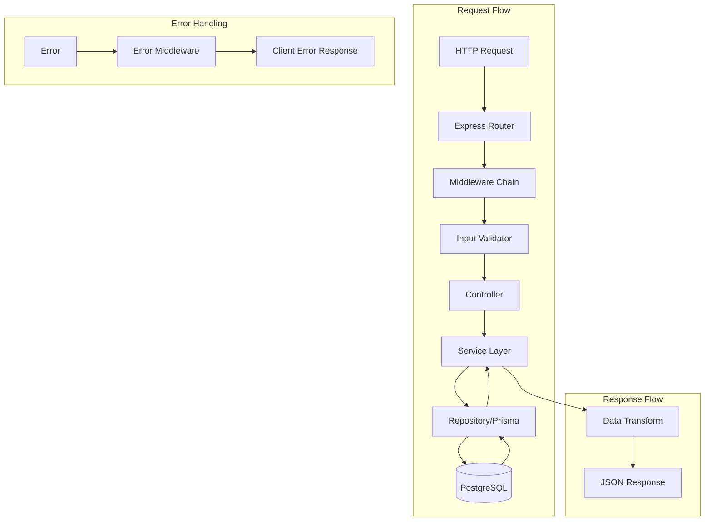
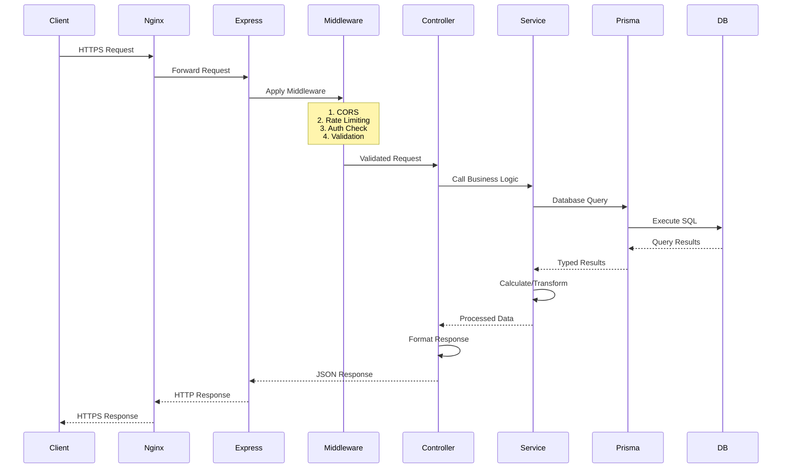

```mermaid
graph TB
    subgraph "Public Endpoints"
        AUTH_LOGIN[POST /auth/login]
        AUTH_REGISTER[POST /auth/register]
        AUTH_GOOGLE[GET /auth/google]
        HEALTH[GET /health]
    end

    subgraph "Protected Endpoints"
        direction TB
        
        subgraph "Analysis APIs"
            A_DAILY[GET /analysis/daily]
            A_WEEKLY[GET /analysis/weekly]
            A_MONTHLY[GET /analysis/monthly]
            A_YEARLY[GET /analysis/yearly]
            A_EVENTS[GET /analysis/events]
            A_SCENARIO[GET /analysis/scenario]
        end
        
        subgraph "Data APIs"
            D_TICKERS[GET /data/tickers]
            D_SYMBOLS[GET /data/symbols]
            D_EVENTS[GET /data/events]
            D_CATEGORIES[GET /data/event-categories]
        end
        
        subgraph "User APIs"
            U_PROFILE[GET /user/profile]
            U_UPDATE[PUT /user/profile]
            U_APIKEYS[GET /user/api-keys]
        end
        
        subgraph "Admin APIs"
            AD_UPLOAD[POST /admin/upload]
            AD_TICKERS[POST /admin/tickers]
            AD_USERS[GET /admin/users]
        end
    end

    CLIENT[Client Applications] --> AUTH_LOGIN & AUTH_REGISTER & AUTH_GOOGLE & HEALTH
    CLIENT --> A_DAILY & A_WEEKLY & A_MONTHLY & A_YEARLY & A_EVENTS & A_SCENARIO
    CLIENT --> D_TICKERS & D_SYMBOLS & D_EVENTS & D_CATEGORIES
    CLIENT --> U_PROFILE & U_UPDATE & U_APIKEYS
    CLIENT --> AD_UPLOAD & AD_TICKERS & AD_USERS
```

# Seasonality SaaS - API Architecture

**Last Updated:** 2026-02-18  
**Base URL:** `http://localhost:3001/api` (Development)  
**Documentation:** All endpoints follow RESTful conventions

---

## 🌐 API Overview



---

## 🔐 Authentication

### Login
```http
POST /api/auth/login
Content-Type: application/json

{
  "email": "user@example.com",
  "password": "securePassword123"
}
```

**Response:**
```json
{
  "success": true,
  "data": {
    "token": "eyJhbGciOiJIUzI1NiIsInR5cCI6IkpXVCJ9...",
    "user": {
      "id": "uuid",
      "email": "user@example.com",
      "name": "John Doe",
      "role": "USER",
      "subscriptionTier": "PRO"
    }
  }
}
```

### Register
```http
POST /api/auth/register
Content-Type: application/json

{
  "email": "user@example.com",
  "password": "securePassword123",
  "name": "John Doe"
}
```

### Google OAuth
```http
GET /api/auth/google
# Redirects to Google OAuth flow

GET /api/auth/google/callback?code=...
# Returns JWT token after successful authentication
```

### Token Usage
All protected endpoints require the JWT token:
```http
Authorization: Bearer <jwt_token>
```

---

## 📊 Analysis Endpoints

### Daily Analysis
```http
GET /api/analysis/daily?symbol=NIFTY&startDate=2020-01-01&endDate=2024-12-31
```

**Query Parameters:**
| Parameter | Type | Required | Description |
|-----------|------|----------|-------------|
| symbol | string | Yes | Stock symbol (e.g., NIFTY) |
| startDate | string | No | Start date (YYYY-MM-DD) |
| endDate | string | No | End date (YYYY-MM-DD) |
| filters | object | No | Year/Month/Day filters |

**Response:**
```json
{
  "success": true,
  "data": {
    "NIFTY": {
      "chartData": [
        {
          "date": "2020-01-01",
          "open": 12000,
          "high": 12100,
          "low": 11950,
          "close": 12050,
          "volume": 1000000,
          "returnPercentage": 0.42
        }
      ],
      "tableData": [...],
      "statistics": {
        "totalCount": 1200,
        "winRate": 52.5,
        "avgReturn": 0.08,
        "cagr": 12.4,
        "sharpeRatio": 1.2,
        "maxDrawdown": -15.3
      }
    }
  }
}
```

### Weekly Analysis
```http
GET /api/analysis/weekly?symbol=NIFTY&weekType=expiry&startDate=2020-01-01
```

**Query Parameters:**
| Parameter | Type | Required | Description |
|-----------|------|----------|-------------|
| symbol | string | Yes | Stock symbol |
| weekType | string | No | 'monday' or 'expiry' (default: expiry) |
| startDate | string | No | Start date |
| endDate | string | No | End date |

### Monthly Analysis
```http
GET /api/analysis/monthly?symbol=NIFTY&startDate=2020-01-01
```

### Yearly Analysis
```http
GET /api/analysis/yearly?symbol=NIFTY&startDate=2015-01-01
```

### Event Analysis
```http
GET /api/analysis/events?symbol=NIFTY&eventName=Budget&windowBefore=5&windowAfter=10
```

**Query Parameters:**
| Parameter | Type | Required | Description |
|-----------|------|----------|-------------|
| symbol | string | Yes | Stock symbol |
| eventName | string | No | Specific event name |
| eventCategory | string | No | Event category (e.g., Economic) |
| windowBefore | number | No | Days before event (default: 10) |
| windowAfter | number | No | Days after event (default: 10) |
| entryPoint | string | No | 'T-1_CLOSE', 'T0_OPEN', 'T0_CLOSE' |
| exitPoint | string | No | Exit timing |

**Response:**
```json
{
  "success": true,
  "data": {
    "eventOccurrences": [
      {
        "eventDate": "2023-02-01",
        "eventName": "Budget 2023",
        "returnPercentage": 2.45,
        "entryPrice": 17800,
        "exitPrice": 18236,
        "holdingDays": 5
      }
    ],
    "averageEventCurve": [
      {
        "relativeDay": -5,
        "avgReturn": 0.5
      },
      {
        "relativeDay": 0,
        "avgReturn": 1.2
      }
    ],
    "aggregatedMetrics": {
      "totalEvents": 12,
      "winRate": 66.7,
      "avgReturn": 1.8,
      "sharpeRatio": 1.5,
      "profitFactor": 2.1
    }
  }
}
```

### Scenario Analysis
```http
POST /api/analysis/scenario
Content-Type: application/json

{
  "symbol": "NIFTY",
  "rules": [
    {
      "type": "dayOfWeek",
      "value": "monday",
      "action": "buy"
    },
    {
      "type": "dayOfWeek",
      "value": "friday",
      "action": "sell"
    }
  ],
  "startDate": "2020-01-01",
  "endDate": "2024-12-31"
}
```

---

## 📈 Data Endpoints

### Get All Tickers
```http
GET /api/data/tickers
```

**Response:**
```json
{
  "success": true,
  "data": [
    {
      "id": 1,
      "symbol": "NIFTY",
      "name": "Nifty 50 Index",
      "exchange": "NSE",
      "totalRecords": 5200,
      "firstDataDate": "2000-01-01",
      "lastDataDate": "2024-12-31"
    }
  ]
}
```

### Get Available Symbols
```http
GET /api/data/symbols
```

### Get Event Names
```http
GET /api/data/event-names?category=Economic&country=INDIA
```

### Get Event Categories
```http
GET /api/data/event-categories
```

---

## 👤 User Endpoints

### Get Profile
```http
GET /api/user/profile
```

### Update Profile
```http
PUT /api/user/profile
Content-Type: application/json

{
  "name": "John Updated",
  "preferences": {
    "defaultSymbol": "NIFTY",
    "theme": "dark"
  }
}
```

### Get API Keys
```http
GET /api/user/api-keys
```

### Generate API Key
```http
POST /api/user/api-keys
Content-Type: application/json

{
  "name": "Trading Bot",
  "expiresInDays": 90
}
```

---

## 🛠️ Admin Endpoints

### Upload CSV Data
```http
POST /api/admin/upload
Content-Type: multipart/form-data

file: <daily.csv>
symbol: NIFTY
dataType: daily
```

**Response:**
```json
{
  "success": true,
  "data": {
    "batchId": "uuid",
    "totalRecords": 5200,
    "processedRecords": 5200,
    "failedRecords": 0,
    "status": "completed"
  }
}
```

### Create Ticker
```http
POST /api/admin/tickers
Content-Type: application/json

{
  "symbol": "NIFTY",
  "name": "Nifty 50 Index",
  "exchange": "NSE",
  "currency": "INR"
}
```

### Get All Users (Admin Only)
```http
GET /api/admin/users?page=1&limit=50
```

---

## 🔍 API Architecture Diagram



---

## 🔄 API Request/Response Flow



---

## 🛡️ Error Handling

All errors follow this format:
```json
{
  "success": false,
  "error": {
    "code": "VALIDATION_ERROR",
    "message": "Invalid input parameters",
    "details": [
      {
        "field": "symbol",
        "message": "Symbol is required"
      }
    ]
  }
}
```

### Error Codes
| Code | HTTP Status | Description |
|------|-------------|-------------|
| UNAUTHORIZED | 401 | Invalid or missing token |
| FORBIDDEN | 403 | Insufficient permissions |
| NOT_FOUND | 404 | Resource not found |
| VALIDATION_ERROR | 400 | Invalid input data |
| RATE_LIMITED | 429 | Too many requests |
| INTERNAL_ERROR | 500 | Server error |

---

## 📊 Rate Limiting

| Endpoint Type | Limit | Window |
|---------------|-------|--------|
| Authentication | 5 | 15 minutes |
| Analysis APIs | 100 | 15 minutes |
| Data APIs | 200 | 15 minutes |
| Admin APIs | 50 | 15 minutes |

---

## 🧪 Testing Endpoints

### Health Check
```http
GET /api/health
```

**Response:**
```json
{
  "status": "healthy",
  "timestamp": "2024-01-01T00:00:00.000Z",
  "services": {
    "database": "healthy",
    "redis": "healthy"
  }
}
```

---

## 📦 Data Models

### Symbol/Ticker
```typescript
interface Ticker {
  id: number;
  symbol: string;
  name: string;
  exchange: string;
  currency: string;
  sector?: string;
  totalRecords: number;
  firstDataDate: Date;
  lastDataDate: Date;
}
```

### OHLCV Data
```typescript
interface SeasonalityData {
  id: number;
  tickerId: number;
  date: Date;
  open: number;
  high: number;
  low: number;
  close: number;
  volume: number;
  openInterest?: number;
}
```

### Analysis Result
```typescript
interface AnalysisResult {
  symbol: string;
  chartData: ChartDataPoint[];
  tableData: TableDataRow[];
  statistics: Statistics;
}

interface Statistics {
  totalCount: number;
  positiveCount: number;
  negativeCount: number;
  winRate: number;
  avgReturn: number;
  medianReturn: number;
  stdDev: number;
  cagr: number;
  sharpeRatio: number;
  maxDrawdown: number;
  profitFactor: number;
}
```

---

## 🚀 API Versioning

Current version: **v1**

All endpoints are prefixed with `/api/v1/`

Future versions will use:
- `/api/v2/` for breaking changes
- `/api/v1/` continues to work for backward compatibility

---

## 📚 Related Documentation

- [Software Architecture](./SOFTWARE_ARCHITECTURE.md) - Overall system design
- [Database Design](./DATABASE_DESIGN.md) - Data models and queries
- [System Design](./SYSTEM_DESIGN.md) - How components work together
- [Calculation Formulas](./CALCULATION_FORMULAS.md) - Statistical methods

---

**Need help?** Contact the development team or check the individual component docs.
