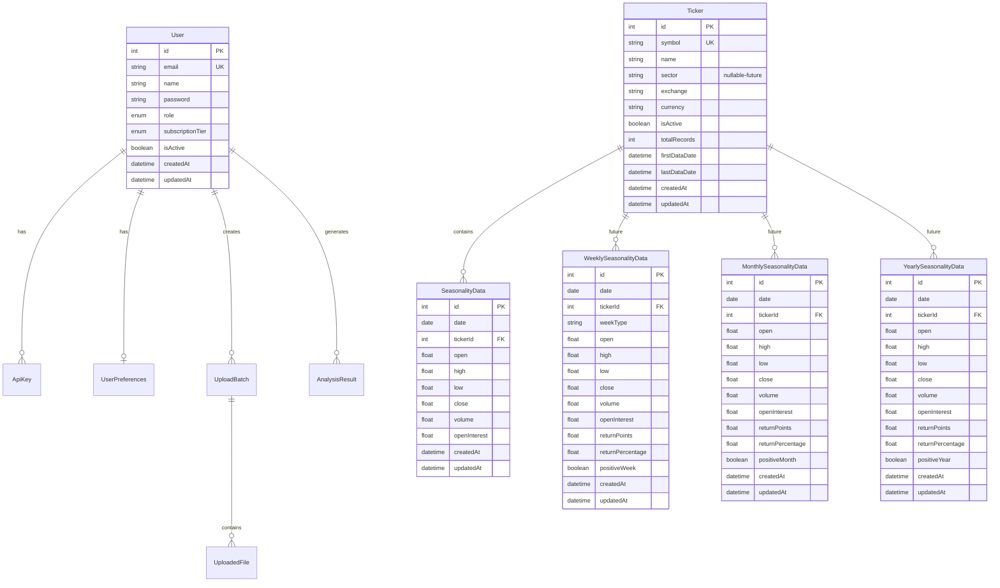

# 🗄️ Seasonality SaaS Database Design Documentation

## 📋 Overview

This document provides a comprehensive overview of the Seasonality SaaS database architecture, designed to handle time-series financial data with high performance and scalability using PostgreSQL with TimescaleDB extensions.

**Two-Phase Implementation Approach**:
- **Phase 1 (Current)**: Basic OHLCV + OpenInterest data from daily.csv files
- **Phase 2 (Future)**: Research team uploads seasonality.csv with calculated fields

## 🏗️ Database Architecture

### **Core Design Principles**
- **Time-Series Optimization**: TimescaleDB hypertables for efficient time-series data storage
- **Scalability**: Designed to handle 10M+ records per symbol
- **Performance**: < 500ms query response time for 95% of requests
- **Data Integrity**: ACID compliance with comprehensive constraints
- **Multi-tenancy**: User isolation and role-based access control
- **Two-Phase Migration**: Support current basic data + future calculated fields

### **Technology Stack**
- **Database**: PostgreSQL 16 with TimescaleDB 2.15+
- **ORM**: Prisma Client for type-safe database access
- **Extensions**: TimescaleDB, pg_stat_statements, btree_gin
- **Optimization**: Hypertables, materialized views, compression policies

## 📊 Database Schema Overview



## 🔄 Data Migration Status & Two-Phase Approach

### **Current Implementation (Phase 1)**
✅ **OHLCV Data**: Successfully migrated from 217 symbols × daily.csv files  
✅ **OpenInterest**: Migrated from daily CSV files  
✅ **Database Schema**: Complete with TimescaleDB optimization  
✅ **Basic Infrastructure**: Ready for API development  

### **Future Implementation (Phase 2)**
🔄 **Research Team Uploads**: seasonality.csv files with calculated fields  
🔄 **Derived Fields**: returnPoints, returnPercentage, positiveDay, etc.  
🔄 **Date Components**: weekday, trading days, calendar days  
🔄 **Classifications**: even/odd, positive/negative patterns  
🔄 **Sector Data**: Will be populated from research data  

### **Two-Phase Migration Architecture**

```mermaid
flowchart TD
    subgraph "Phase 1: Current Implementation ✅"
        A[Old CSV Files<br/>217 Symbols × daily.csv<br/>OHLCV + OpenInterest] --> B[✅ COMPLETED<br/>Data Migration Script]
        B --> C{✅ File Processing}
        C --> D[✅ Parse OHLCV Fields]
        C --> E[✅ Validate Data Types]
        C --> F[✅ Create Tickers]
        
        D --> G[✅ SeasonalityData Table<br/>Basic OHLCV + OpenInterest]
        E --> G
        F --> G
    end
    
    subgraph "Phase 2: Future Implementation 🔄"
        H[Research Team Uploads<br/>seasonality.csv files] --> I[🔄 Upload System<br/>CSV Processing]
        I --> J{🔄 Calculate Fields}
        J --> K[🔄 Weekly Calculations]
        J --> L[🔄 Monthly Calculations]
        J --> M[🔄 Yearly Calculations]
        
        K --> N[🔄 WeeklySeasonalityData]
        L --> O[🔄 MonthlySeasonalityData]
        M --> P[🔄 YearlySeasonalityData]
    end
    
    G --> Q[✅ API Development Ready<br/>Basic OHLCV Queries]
    N --> R[🔄 Full Feature Parity<br/>Complete Analysis Suite]
    O --> R
    P --> R
    
    style A fill:#e1f5fe
    style B fill:#c8e6c9
    style C fill:#c8e6c9
    style G fill:#c8e6c9
    style H fill:#fff3e0
    style I fill:#fff3e0
    style Q fill:#c8e6c9
    style R fill:#fff3e0
```


### **Current Database Tables (Phase 1)**
- **SeasonalityData**: OHLCV + OpenInterest from daily.csv files
- **Ticker**: Symbol metadata (sector will be populated later)
- **User Management**: Complete authentication system
- **File Upload**: Ready for Phase 2 research uploads

### **Future Database Tables (Phase 2)**
- **WeeklySeasonalityData**: Monday/Expiry weekly data with calculations
- **MonthlySeasonalityData**: Monthly data with return calculations
- **YearlySeasonalityData**: Yearly data with performance metrics
- **CalculatedFields**: Advanced technical indicators

## 📈 TimescaleDB Hypertable Structure


## 🚀 Query Performance Architecture


## 📊 Data Flow Architecture


## 🔧 Database Optimization Strategy

### **Indexing Strategy**


### **Materialized Views**


## 🔄 Data Processing Pipeline


## 📋 Table Specifications

### **Phase 1: Current Implementation Tables**

#### **SeasonalityData Table (Current)**
- **Purpose**: Store basic OHLCV + OpenInterest data from daily.csv files
- **Partitioning**: Monthly chunks via TimescaleDB
- **Indexes**: (tickerId, date DESC), (date DESC, tickerId)
- **Compression**: 3+ months old data
- **Retention**: 10 years
- **Status**: ✅ Implemented and populated with 217 symbols

#### **Ticker Table (Current)**
- **Purpose**: Symbol metadata and statistics
- **Key Fields**: symbol (unique), name, exchange
- **Future Fields**: sector (will be populated from research data)
- **Statistics**: totalRecords, firstDataDate, lastDataDate
- **Indexes**: symbol, exchange
- **Status**: ✅ Implemented with 217 symbols

### **Phase 2: Future Implementation Tables**

#### **WeeklySeasonalityData Table (Future)**
- **Purpose**: Store Monday/Expiry weekly data with calculated fields
- **Partitioning**: 3-month chunks
- **Week Types**: 'monday', 'expiry'
- **Calculated Fields**: returnPoints, returnPercentage, positiveWeek
- **Compression**: 6+ months old data
- **Retention**: 15 years
- **Status**: 🔄 Schema ready, awaiting research team uploads

#### **MonthlySeasonalityData Table (Future)**
- **Purpose**: Store monthly aggregated data with calculations
- **Partitioning**: 1-year chunks
- **Calculated Fields**: returnPoints, returnPercentage, positiveMonth
- **Compression**: 1+ year old data
- **Retention**: 20 years
- **Status**: 🔄 Schema ready, awaiting research team uploads

#### **YearlySeasonalityData Table (Future)**
- **Purpose**: Store yearly aggregated data with performance metrics
- **Partitioning**: 5-year chunks
- **Calculated Fields**: returnPoints, returnPercentage, positiveYear
- **Compression**: 2+ years old data
- **Retention**: 25 years
- **Status**: 🔄 Schema ready, awaiting research team uploads

### **Supporting Tables**

#### **User Management Tables (Current)**
- **User**: Authentication and subscription management
- **ApiKey**: API access control with rate limiting
- **UserPreferences**: User-specific settings and defaults
- **Status**: ✅ Complete implementation ready

#### **File Processing Tables (Current)**
- **UploadBatch**: Batch upload tracking for research team uploads
- **UploadedFile**: Individual file processing status
- **Status**: ✅ Ready for Phase 2 research uploads

## 🔍 Query Patterns & Optimization

### **Common Query Patterns**
```sql
-- Phase 1: Current Implementation Queries

-- 1. Recent OHLCV data for a symbol (optimized with partial index)
SELECT * FROM "SeasonalityData" 
WHERE tickerId = ? AND date >= CURRENT_DATE - INTERVAL '1 year'
ORDER BY date DESC;

-- 2. Cross-symbol basic analysis
SELECT 
    t.symbol,
    COUNT(sd.id) as record_count,
    MIN(sd.date) as first_date,
    MAX(sd.date) as last_date,
    AVG(sd.close) as avg_close
FROM "Ticker" t
LEFT JOIN "SeasonalityData" sd ON t.id = sd.tickerId
GROUP BY t.id, t.symbol;

-- 3. Time-range OHLCV aggregation (leverages hypertable chunks)
SELECT 
    DATE_TRUNC('month', date) as month,
    AVG(close) as avg_close,
    MAX(high) as max_high,
    MIN(low) as min_low
FROM "SeasonalityData" 
WHERE tickerId = ? AND date BETWEEN ? AND ?
GROUP BY DATE_TRUNC('month', date);

-- Phase 2: Future Implementation Queries (when research data is uploaded)

-- 4. Weekly seasonality analysis
SELECT 
    weekType,
    AVG(returnPercentage) as avg_return,
    COUNT(CASE WHEN positiveWeek THEN 1 END) as positive_weeks,
    COUNT(*) as total_weeks
FROM "WeeklySeasonalityData"
WHERE tickerId = ? AND date >= ?
GROUP BY weekType;

-- 5. Monthly performance patterns
SELECT 
    EXTRACT(MONTH FROM date) as month,
    AVG(returnPercentage) as avg_monthly_return,
    STDDEV(returnPercentage) as volatility
FROM "MonthlySeasonalityData"
WHERE tickerId = ?
GROUP BY EXTRACT(MONTH FROM date)
ORDER BY month;
```

### **Performance Optimizations**
1. **Chunk Exclusion**: TimescaleDB automatically excludes irrelevant chunks
2. **Parallel Processing**: Queries span multiple chunks in parallel
3. **Compression**: Older data compressed for storage efficiency
4. **Materialized Views**: Pre-computed aggregations for common queries
5. **Strategic Indexes**: Covering indexes for frequent query patterns

## 🔧 Maintenance & Monitoring

### **Automated Maintenance Jobs**


### **Monitoring Queries**
```sql
-- Database size and growth
SELECT * FROM get_database_statistics();

-- Query performance monitoring
SELECT * FROM query_performance;

-- Index usage statistics
SELECT * FROM index_usage_stats;

-- Hypertable chunk information
SELECT * FROM timescaledb_information.chunks;
```

## 📊 Scalability Considerations

### **Horizontal Scaling Options**

```mermaid
graph TB
    subgraph "Current Architecture"
        A[Single PostgreSQL Instance<br/>with TimescaleDB]
    end
    
    subgraph "Scaling Options"
        B[Read Replicas<br/>for Analytics]
        C[Distributed Hypertables<br/>across Nodes]
        D[Connection Pooling<br/>PgBouncer]
    end
    
    subgraph "Performance Targets"
        E[100 Users → 1000 Users]
        F[5GB Data → 25GB Data]
        G[< 500ms Response Time]
    end
    
    A --> B
    A --> C
    A --> D
    
    B --> E
    C --> F
    D --> G
    
    style A fill:#e1f5fe
    style E fill:#c8e6c9
    style F fill:#c8e6c9
    style G fill:#c8e6c9
```


## 🎯 Success Metrics

### **Performance Benchmarks**
- **Query Response Time**: < 500ms for 95% of queries
- **Concurrent Users**: 1000+ simultaneous connections
- **Data Volume**: 10M+ records per symbol
- **Throughput**: 10,000+ queries per minute
- **Availability**: 99.9% uptime

### **Storage Efficiency**
- **Compression Ratio**: 70% reduction for historical data
- **Index Overhead**: < 20% of table size
- **Chunk Size**: Optimal 25MB-100MB per chunk
- **Retention**: Automatic cleanup of old data

## 🔐 Security & Compliance

### **Data Security**
- **Encryption**: At-rest and in-transit encryption
- **Access Control**: Role-based permissions
- **Audit Logging**: Complete audit trail
- **API Security**: Rate limiting and authentication

### **Backup & Recovery**
- **Automated Backups**: Daily full backups
- **Point-in-time Recovery**: WAL-based recovery
- **Cross-region Replication**: Disaster recovery
- **Backup Testing**: Monthly recovery drills

---

## 📚 Additional Resources

- **TimescaleDB Documentation**: [https://docs.timescale.com/](https://docs.timescale.com/)
- **Prisma Documentation**: [https://www.prisma.io/docs/](https://www.prisma.io/docs/)
- **PostgreSQL Performance Tuning**: [https://wiki.postgresql.org/wiki/Performance_Optimization](https://wiki.postgresql.org/wiki/Performance_Optimization)

---

**🎉 This database architecture provides a solid foundation for the Seasonality SaaS platform with enterprise-grade performance, scalability, and reliability.**