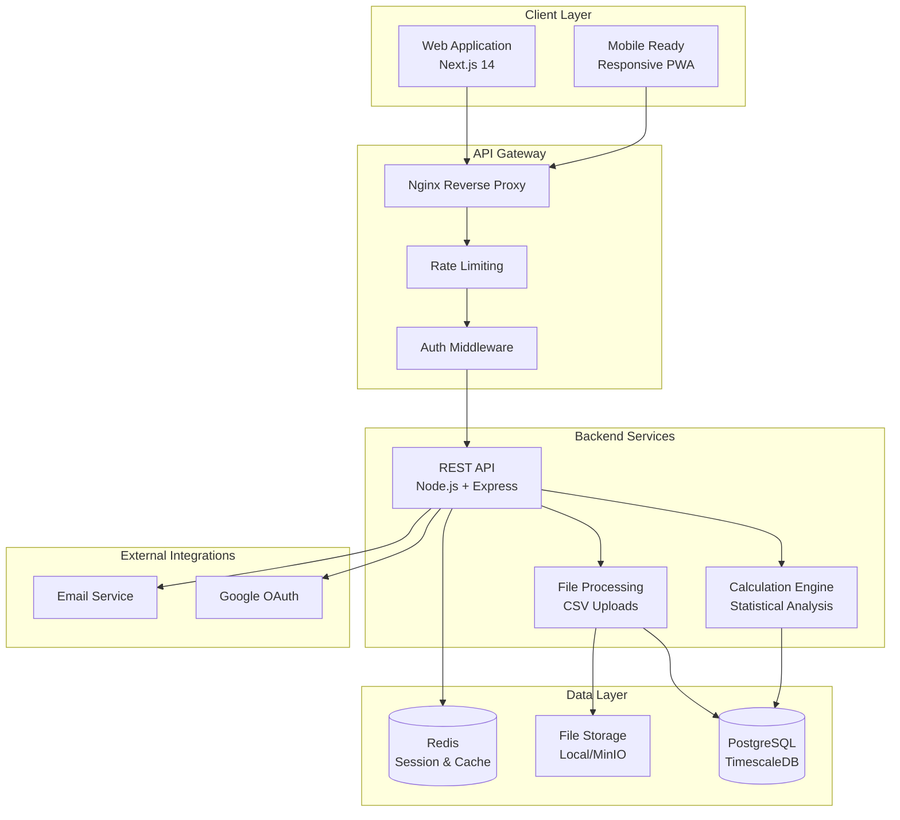
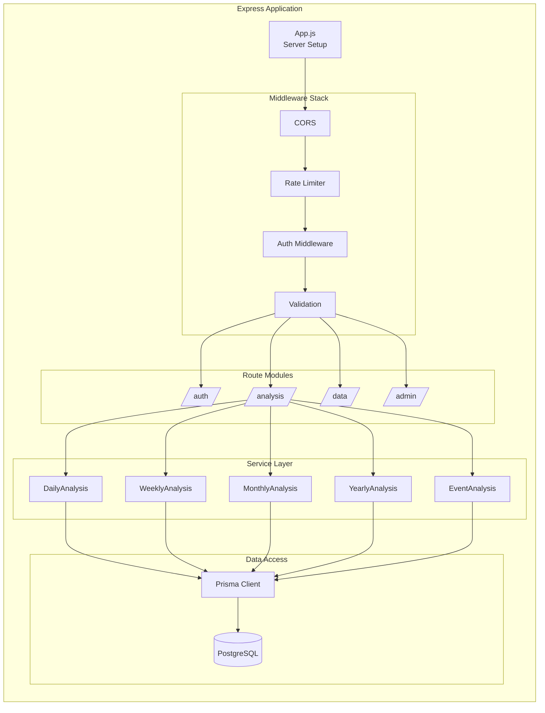
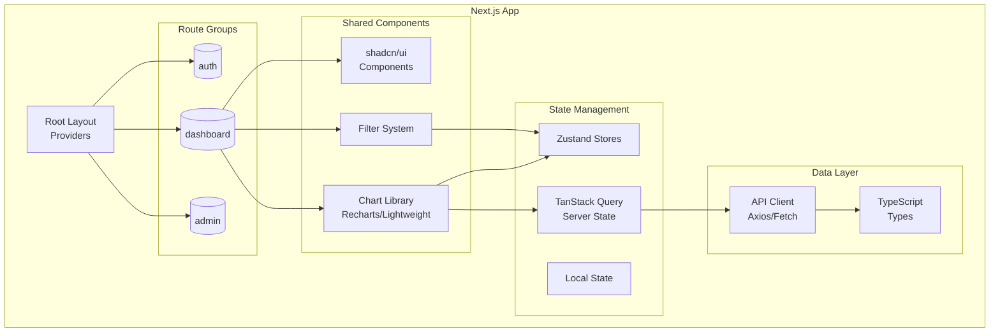
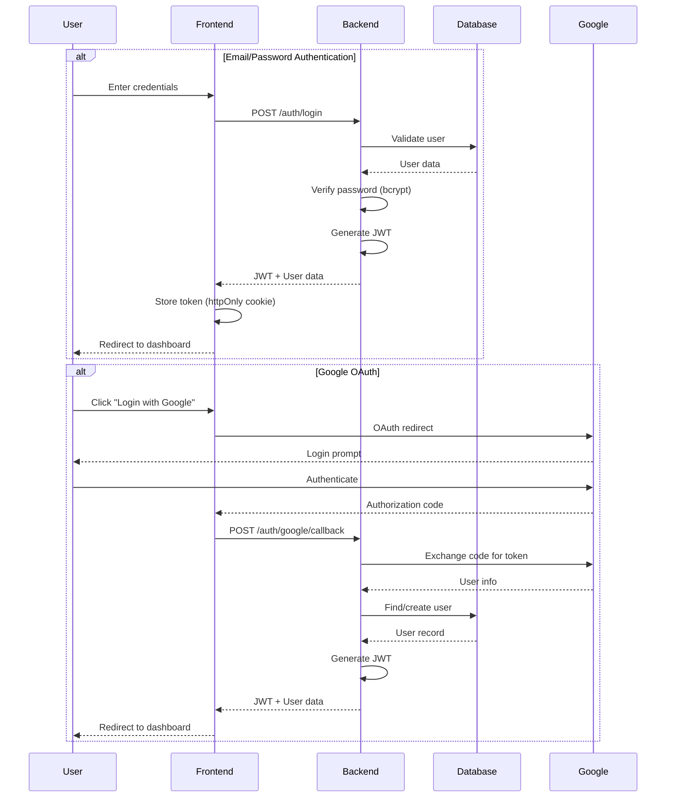
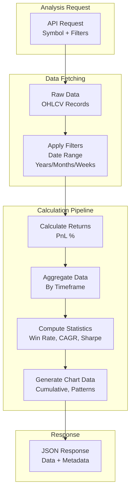
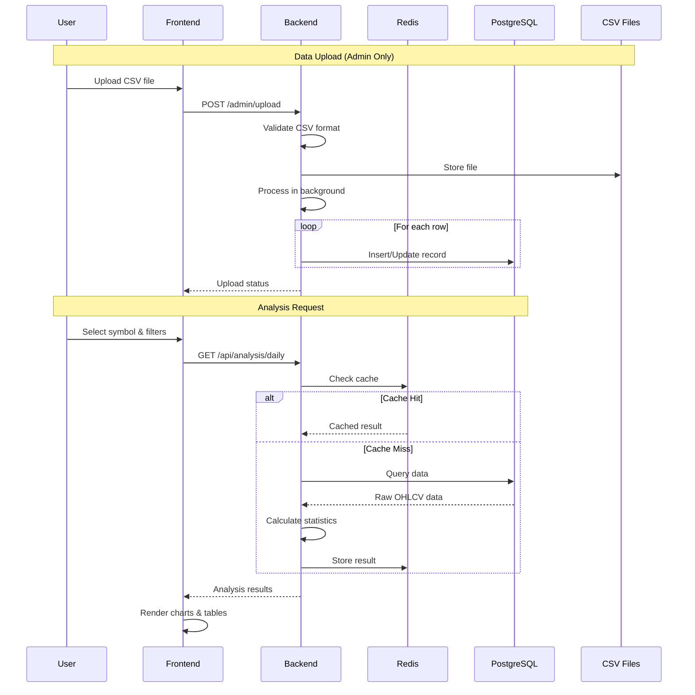
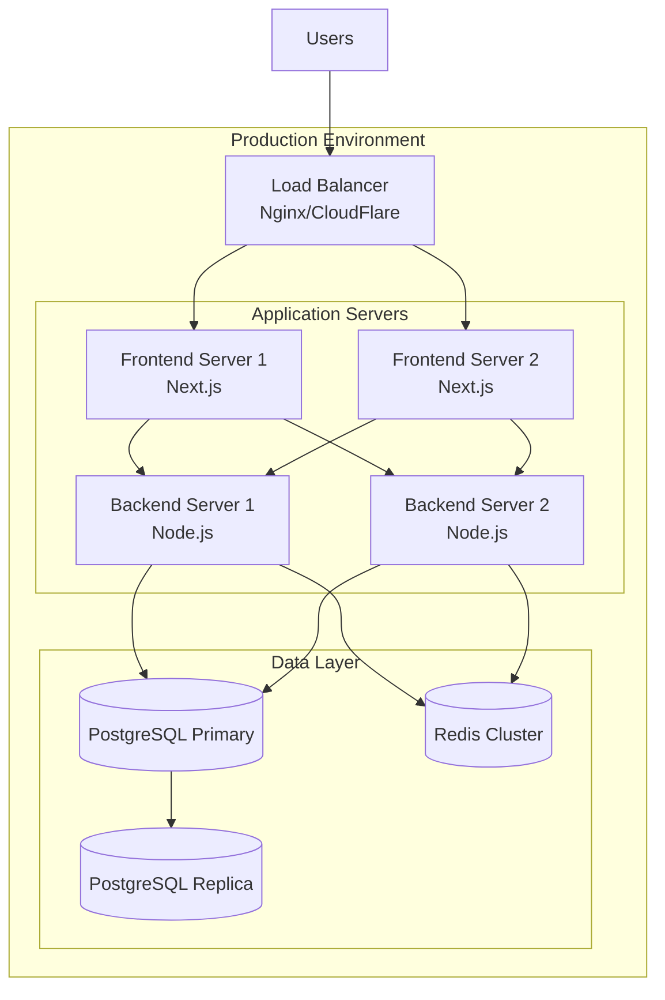
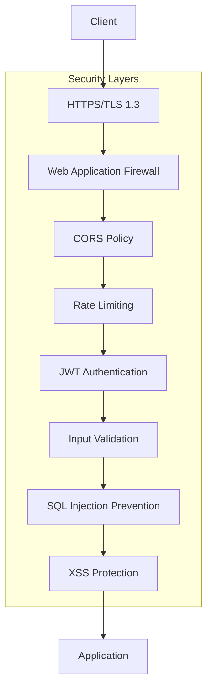

# Seasonality SaaS - Software Architecture

**Last Updated:** 2026-02-18  
**Version:** 2.0  
**Purpose:** Complete architectural overview for developers and stakeholders

---

## 🏗️ System Overview

Seasonality SaaS is a financial analysis platform that identifies seasonal patterns in stock market data. The platform helps traders and analysts discover recurring patterns across different timeframes (daily, weekly, monthly, yearly) and special events.



---

## 📁 Monorepo Structure

```
new-seasonality/
├── 📂 apps/
│   ├── 📂 backend/              # Node.js + Express API
│   │   ├── 📂 src/
│   │   │   ├── 📂 controllers/  # Route handlers
│   │   │   ├── 📂 services/     # Business logic
│   │   │   ├── 📂 routes/       # API endpoint definitions
│   │   │   ├── 📂 middleware/   # Auth, validation, error handling
│   │   │   ├── 📂 models/       # Prisma schema
│   │   │   ├── 📂 utils/        # Helper functions
│   │   │   └── 📂 config/       # Environment configs
│   │   ├── 📂 prisma/           # Database schema & migrations
│   │   └── 📂 scripts/          # Data migration scripts
│   │
│   └── 📂 frontend/             # Next.js 14 Application
│       ├── 📂 src/
│       │   ├── 📂 app/          # Next.js app router
│       │   │   ├── 📂 (dashboard)/   # Protected routes
│       │   │   │   ├── 📂 dashboard/
│       │   │   │   │   ├── 📂 daily/
│       │   │   │   │   ├── 📂 weekly/
│       │   │   │   │   ├── 📂 monthly/
│       │   │   │   │   ├── 📂 yearly/
│       │   │   │   │   ├── 📂 events/
│       │   │   │   │   └── 📂 ...
│       │   │   │   └── 📂 admin/
│       │   │   ├── 📂 api/      # API routes
│       │   │   └── 📂 login/    # Auth pages
│       │   ├── 📂 components/   # React components
│       │   │   ├── 📂 charts/   # Chart components
│       │   │   ├── 📂 filters/  # Filter components
│       │   │   ├── 📂 layout/   # Layout components
│       │   │   └── 📂 ui/       # shadcn/ui components
│       │   ├── 📂 hooks/        # Custom React hooks
│       │   ├── 📂 lib/          # Utilities & API clients
│       │   ├── 📂 store/        # Zustand state management
│       │   └── 📂 types/        # TypeScript types
│       └── 📂 public/           # Static assets
│
├── 📂 MDfiles/                  # Documentation
├── 📂 packages/                 # Shared packages (if any)
├── 📄 docker-compose.yml        # Local development stack
├── 📄 package.json             # Root package.json
└── 📄 README.md                # Project overview
```

---

## 🎯 Core Components

### 1. **Backend Architecture**



### 2. **Frontend Architecture**



---

## 🔐 Authentication Flow



---

## 🧮 Analysis Engine Architecture

The calculation engine processes time-series data to identify seasonal patterns.



---

## 🔄 Data Flow



---

## 🛠️ Technology Stack

### Backend
| Component | Technology | Purpose |
|-----------|-----------|---------|
| Runtime | Node.js 20 | JavaScript runtime |
| Framework | Express.js 4 | Web framework |
| Database | PostgreSQL 16 + TimescaleDB | Time-series data |
| ORM | Prisma 5 | Database access |
| Auth | JWT + bcrypt | Authentication |
| Validation | express-validator | Input validation |
| Testing | Jest | Unit tests |

### Frontend
| Component | Technology | Purpose |
|-----------|-----------|---------|
| Framework | Next.js 14 (App Router) | React framework |
| Language | TypeScript 5 | Type safety |
| Styling | Tailwind CSS 3 | Utility-first CSS |
| Components | shadcn/ui | UI component library |
| Charts | Recharts + Lightweight Charts | Data visualization |
| State | Zustand | Client state |
| Server State | TanStack Query | API caching |
| Icons | Lucide React | Icon library |

### Infrastructure
| Component | Technology | Purpose |
|-----------|-----------|---------|
| Container | Docker + Docker Compose | Development environment |
| Web Server | Nginx | Reverse proxy |
| Cache | Redis | Session & API caching |
| Storage | MinIO (optional) | File storage |

---

## 🎨 Design Patterns

### 1. **Service Pattern (Backend)**
```javascript
// services/DailyAnalysisService.js
class DailyAnalysisService {
  async analyze(symbol, filters) {
    const data = await this.fetchData(symbol, filters);
    const returns = this.calculateReturns(data);
    const statistics = this.computeStatistics(returns);
    return { data, returns, statistics };
  }
}
```

### 2. **Repository Pattern (Backend)**
```javascript
// repositories/SeasonalityRepository.js
class SeasonalityRepository {
  async findBySymbolAndDateRange(symbol, startDate, endDate) {
    return prisma.seasonalityData.findMany({
      where: { ticker: { symbol }, date: { gte: startDate, lte: endDate } },
      orderBy: { date: 'asc' }
    });
  }
}
```

### 3. **Compound Component Pattern (Frontend)**
```typescript
// components/filters/FilterSection.tsx
<FilterSection>
  <FilterSection.Header title="Time Range" />
  <FilterSection.Content>
    <DateRangePicker />
  </FilterSection.Content>
</FilterSection>
```

### 4. **Custom Hooks Pattern (Frontend)**
```typescript
// hooks/useAnalysis.ts
export function useAnalysis(symbol: string, timeframe: string) {
  return useQuery({
    queryKey: ['analysis', symbol, timeframe],
    queryFn: () => fetchAnalysis(symbol, timeframe),
    staleTime: 5 * 60 * 1000, // 5 minutes
  });
}
```

---

## 🚀 Deployment Architecture



---

## 📊 Scalability Strategy

### Horizontal Scaling
- **Frontend**: Static export to CDN (Vercel/CloudFront)
- **Backend**: Multiple Node.js instances behind load balancer
- **Database**: Read replicas for analytics queries
- **Cache**: Redis Cluster for distributed caching

### Performance Optimization
- **Database**: TimescaleDB hypertables for time-series data
- **Caching**: API response caching (1-hour TTL)
- **Frontend**: Component lazy loading, image optimization
- **CDN**: Static assets served from edge locations

---

## 🔒 Security Architecture



---

## 📈 Monitoring & Observability

- **Logging**: Structured JSON logs with correlation IDs
- **Metrics**: Application performance metrics (response time, error rate)
- **Health Checks**: `/health` endpoint for all services
- **Alerting**: Email/Slack notifications for critical errors

---

## 🎯 Key Architectural Decisions

| Decision | Rationale |
|----------|-----------|
| **Monorepo** | Shared types, easier coordination between frontend/backend |
| **TimescaleDB** | Native time-series support, automatic partitioning |
| **Next.js App Router** | Server components for better performance |
| **Zustand** | Simple, lightweight state management |
| **Prisma** | Type-safe database access, migration support |
| **Docker** | Consistent development environment |

---

## 📚 Related Documentation

- [API Architecture](./API_ARCHITECTURE.md) - All API endpoints
- [Database Design](./DATABASE_DESIGN.md) - Schema and queries
- [System Design](./SYSTEM_DESIGN.md) - How it works
- [Calculation Formulas](./CALCULATION_FORMULAS.md) - Statistical methods

---

**Questions?** Check the individual component documentation or ask the team!
