# Seasonality SaaS - System Design

**Last Updated:** 2026-02-18  
**Purpose:** Complete guide to how the system works internally

---

## 🎯 System Overview

Seasonality SaaS helps traders identify recurring patterns in financial markets. The system analyzes historical data to find seasonal trends across different timeframes.

### What the System Does
1. **Ingests** historical OHLCV data (Open, High, Low, Close, Volume)
2. **Calculates** returns and statistical metrics
3. **Identifies** seasonal patterns (daily, weekly, monthly, yearly)
4. **Analyzes** special events impact on prices
5. **Visualizes** data through interactive charts and tables

---

## 🔄 Complete Data Flow


---

## 📊 How Analysis Works

### 1. Daily Analysis Flow


### 2. Calculation Pipeline

```mermaid
graph LR
    subgraph "Input"
        RAW[Raw OHLCV Data<br/>date, open, high, low, close]
    end

    subgraph "Step 1: Calculate Returns"
        PNL[Point Return<br/>close - prevClose]
        PCT[Percentage Return<br/>PNL / prevClose × 100]
    end

    subgraph "Step 2: Aggregate"
        GROUP[Group by Timeframe<br/>Day/Week/Month/Year]
        AVG[Average Returns]
        SUM[Sum of Returns]
    end

    subgraph "Step 3: Statistics"
        WIN[Win Rate<br/>% of positive returns]
        CAGR[Compound Annual Growth]
        SHARPE[Risk-Adjusted Return]
        DD[Maximum Drawdown]
    end

    subgraph "Output"
        RESULT[Analysis Result<br/>Ready for Display]
    end

    RAW --> PNL --> PCT --> GROUP --> AVG --> SUM --> WIN --> CAGR --> SHARPE --> DD --> RESULT
```



---

## 🎨 Frontend System Design

### State Management Flow


### Component Hierarchy

```
DashboardLayout
├── Header
│   ├── Logo
│   ├── Symbol Selector
│   └── User Menu
├── Left Sidebar (Navigation)
│   ├── Daily
│   ├── Weekly
│   ├── Monthly
│   ├── Yearly
│   ├── Events
│   └── ...
├── Main Content Area
│   ├── Stats Strip
│   ├── Chart Mode Selector
│   ├── Charts Section
│   │   ├── Main Chart (Cumulative/Yearly)
│   │   └── Analytics Matrix
│   ├── Secondary Charts
│   │   ├── Superimposed Pattern
│   │   └── Pattern Returns
│   └── Data Tables
└── Right Filter Console
    ├── Symbol Selector
    ├── Time Range Picker
    ├── Year/Month/Day Filters
    └── Advanced Filters
```

---

## ⚙️ Backend System Design

### Service Architecture


### How Analysis Services Work

**DailyAnalysisService Example:**
```javascript
class DailyAnalysisService {
  async analyze(symbol, filters) {
    // 1. Fetch raw data from database
    const rawData = await this.repository.findBySymbolAndDateRange(
      symbol, 
      filters.startDate, 
      filters.endDate
    );

    // 2. Apply user filters (years, months, days)
    const filteredData = this.applyFilters(rawData, filters);

    // 3. Calculate returns for each day
    const returns = this.calculateReturns(filteredData);

    // 4. Compute statistics
    const statistics = this.computeStatistics(returns);

    // 5. Generate chart-ready data
    const chartData = this.prepareChartData(returns);

    // 6. Generate table data
    const tableData = this.prepareTableData(returns);

    return {
      symbol,
      chartData,
      tableData,
      statistics,
      filters
    };
  }
}
```

---

## 📈 Chart Rendering System

### Chart Types & Their Purposes


### Chart Data Preparation

**Cumulative Chart Example:**
```javascript
// Transform raw returns into cumulative data
function prepareCumulativeData(returns) {
  let cumulative = 1; // Start at 1 (100%)
  
  return returns.map(day => {
    cumulative = cumulative * (1 + day.returnPercentage / 100);
    return {
      date: day.date,
      cumulativeReturn: (cumulative - 1) * 100 // Convert to percentage
    };
  });
}
```

---

## 🗄️ Caching Strategy

### Multi-Level Caching


### Cache Invalidation
- **Analysis Results**: 1 hour TTL, invalidated on new data upload
- **Symbol Lists**: 24 hour TTL, invalidated when new ticker added
- **User Data**: On profile update

---

## 🔒 Security Flow

### Authentication & Authorization


---

## 📊 Event Analysis System

### How Event Analysis Works


---

## 🚀 Performance Optimizations

### Database Query Optimization

**Chunk Exclusion (TimescaleDB):**
```sql
-- Automatically excludes chunks outside date range
SELECT * FROM seasonality_data 
WHERE ticker_id = 1 
  AND date BETWEEN '2020-01-01' AND '2020-12-31';
-- Only scans 1 chunk (1 month) instead of all 60 months
```

**Parallel Processing:**
```javascript
// Multiple chunks processed in parallel
const promises = chunks.map(chunk => 
  db.query(`SELECT ... FROM ${chunk.table_name} WHERE ...`)
);
const results = await Promise.all(promises);
```

### Frontend Optimizations

**Lazy Loading:**
```typescript
// Charts loaded only when needed
const SeasonalityChart = dynamic(
  () => import('@/components/charts/SeasonalityChart'),
  { ssr: false, loading: () => <Skeleton /> }
);
```

**Virtualized Tables:**
```typescript
// Only render visible rows
<VirtualizedTable
  data={10000Rows}
  rowHeight={40}
  overscan={5}
/>
```

---

## 🧪 Testing Strategy

### Testing Pyramid

```mermaid
graph TD
    subgraph "Testing Layers"
        E2E[End-to-End Tests<br/>Playwright<br/>10%]
        INT[Integration Tests<br/>Jest + Supertest<br/>20%]
        UNIT[Unit Tests<br/>Jest<br/>70%]
    end

    subgraph "What We Test"
        E2E --> USER[User Workflows<br/>Login → Analysis → Export]
        INT --> API[API Endpoints<br/>Request/Response]
        UNIT --> CALC[Calculations<br/>Statistics]
        UNIT --> COMP[Components<br/>Rendering]
    end
```



---

## 📈 Scaling Strategy

### Current Scale
- **Symbols**: 217 tickers
- **Records**: ~1.2M records (217 × 5,000 days)
- **Concurrent Users**: 50-100
- **Query Time**: <500ms for 95% of requests

### Future Scale
- **Symbols**: 2,000+ tickers
- **Records**: 100M+ records
- **Concurrent Users**: 1,000+
- **Query Time**: <200ms with optimization

### Scaling Steps
1. **Database**: Read replicas, connection pooling
2. **Caching**: Redis Cluster, CDN for static assets
3. **API**: Horizontal scaling with load balancer
4. **Frontend**: Static export to CDN

---

## 📚 Related Documentation

- [Software Architecture](./SOFTWARE_ARCHITECTURE.md) - High-level design
- [API Architecture](./API_ARCHITECTURE.md) - API endpoints
- [Database Design](./DATABASE_DESIGN.md) - Data models
- [Calculation Formulas](./CALCULATION_FORMULAS.md) - Math explained

---

**Questions?** This document explains HOW things work. Check other docs for specific details!
